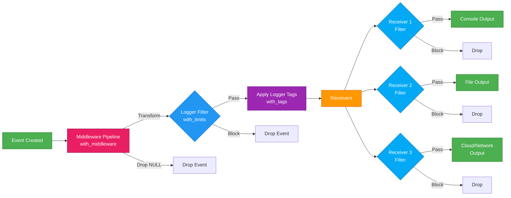

# logthis 

> **A Structured Logging Framework for R**

<!-- badges: start -->
[](https://lifecycle.r-lib.org/articles/stages.html#experimental)
[](https://github.com/iqis/logthis/actions/workflows/R-CMD-check.yaml)
[](https://app.codecov.io/gh/iqis/logthis?branch=main)
[](https://CRAN.R-project.org/package=logthis)
<!-- badges: end -->

`logthis` is a sophisticated logging package for R that provides a flexible, structured approach to application logging. It implements enterprise-level logging patterns similar to log4j or Python's logging module, specifically designed for the R ecosystem.

## Features

### Core Capabilities
- 🎯 **Hierarchical Event Levels** - Categorize messages by importance (0-100 scale)
- 🎨 **Multiple Output Receivers** - Send logs to console, files, cloud storage, and more
- ⚙️ **Configurable Filtering** - Set min/max level limits to control output
- 🔧 **Composable Design** - Use functional programming patterns with pipes
- ⚡ **Middleware Pipeline** - Transform events with PII redaction, context enrichment, and sampling
- 🔗 **Logger Chaining** - Chain multiple loggers together for complex routing
- 📋 **Scope-Based Enhancement** - Add receivers within specific scopes without affecting parent loggers
- 🌈 **Color-Coded Console Output** - Visual distinction for different log levels
- 📝 **Structured Events** - Rich metadata with timestamps, tags, and custom fields
- 🏷️ **Flexible Tagging System** - Track provenance, context, and categorization with hierarchical tags

### 🏥 GxP Validation & Pharma Compliance

**logthis provides enterprise-grade audit trails for pharmaceutical and clinical data validation**, integrating seamlessly with R's validation ecosystem ({validate}, {pointblank}, {arsenal}) to meet 21 CFR Part 11, GxP, and ALCOA+ requirements.

**Key compliance features:**
- **Complete audit trails** - ALCOA+ compliant (Attributable, Legible, Contemporaneous, Original, Accurate)
- **Electronic signatures** - 21 CFR Part 11 Part B compliance
- **Validation framework integration** - Built-in helpers for {validate}, {pointblank}, {arsenal}
- **Immutable logging** - JSON audit trails with data integrity hashing
- **Regulatory reporting** - Export compliance reports for FDA/EMA submissions

**Quick example:**
```r
library(validate)
library(logthis)

# Create GxP-compliant logger
log_gxp <- logger() %>%
  with_tags(
    study_id = "STUDY-001",
    system_name = "Clinical Data Validation",
    regulation = "21CFR11"
  ) %>%
  with_receivers(
    to_json() %>% on_local(path = "audit_trail.jsonl")
  )

# Define validation rules
rules <- validator(
  age_valid = age >= 18 & age <= 100,
  weight_positive = weight > 0
)

# Validate with complete audit trail
validate_with_audit(
  data = clinical_data,
  rules = rules,
  logger = log_gxp,
  user_id = "data_manager",
  reason = "Protocol amendment validation"
)

# Apply electronic signature (21 CFR Part 11)
esign_validation(
  validation_object = result,
  logger = log_gxp,
  user_id = "reviewer",
  password_hash = hash_password("..."),
  meaning = "Validation Approved"
)
```

**See [GxP Compliance vignette](vignettes/gxp-compliance.Rmd) for comprehensive guidance.**

---

### 📊 Tidyverse Pipeline Logging (tidylog Integration)

**Automatic audit trails for dplyr/tidyr data transformations** - integrates with {tidylog} to capture every pipeline operation with complete metadata for reproducibility and GxP compliance.

**Key features:**
- **Automatic transformation logging** - No manual logging needed
- **Data integrity hashing** - SHA256 hashes for input/output verification
- **Operation metadata** - Rows changed, columns modified, transformation details
- **GxP-ready pipelines** - Complete audit trails for regulatory compliance
- **Pipeline validation** - Optional output validation with logging

**Quick example:**
```r
library(dplyr)
library(tidylog)
library(logthis)

# Create pipeline logger with tidylog integration
log_pipe <- logger() %>%
  with_tags(
    study_id = "STUDY-001",
    pipeline_name = "data_cleaning"
  ) %>%
  with_receivers(
    to_json() %>% on_local(path = "pipeline_audit.jsonl")
  )

# Enable tidylog integration
log_tidyverse(logger = log_pipe, pipeline_id = "data_cleaning")

# Now all dplyr/tidyr operations are logged automatically
result <- mtcars %>%
  filter(mpg > 20) %>%           # Logged: "filter: removed 18 rows (56%)"
  mutate(efficiency = mpg / hp) %>%  # Logged: "mutate: new variable 'efficiency'"
  select(mpg, hp, efficiency)    # Logged: "select: dropped 8 variables"

# Or use comprehensive pipeline audit wrapper
result <- with_pipeline_audit(
  data = mtcars,
  pipeline_expr = ~ . %>%
    filter(mpg > 20) %>%
    mutate(efficiency = mpg / hp),
  logger = log_pipe,
  pipeline_name = "fuel_analysis",
  user_id = "analyst"
)
```

**Audit trail output:**
```json
{"time":"2025-10-10T15:00:01Z","level":"NOTE","message":"Pipeline started: data_cleaning","pipeline_name":"data_cleaning","input_rows":32,"input_cols":11,"input_hash":"a1b2c3..."}
{"time":"2025-10-10T15:00:02Z","level":"NOTE","message":"filter: removed 18 rows (56%), 14 rows remaining","operation":"filter","details":"removed 18 rows (56%)","transformation_type":"tidyverse"}
{"time":"2025-10-10T15:00:02Z","level":"NOTE","message":"mutate: new variable 'efficiency' (double) with 14 unique values","operation":"mutate","transformation_type":"tidyverse"}
{"time":"2025-10-10T15:00:03Z","level":"NOTE","message":"Pipeline completed: data_cleaning","output_rows":14,"output_cols":3,"rows_changed":-18,"output_hash":"d4e5f6..."}
```

**Perfect for:**
- CDISC SDTM/ADaM derivations
- Data cleaning pipelines
- ETL workflows
- Regulatory submissions

---

### ⭐ Shiny Integration (No Python Equivalent)

**The [`logshiny`](logshiny/) companion package** provides complete Shiny logging integration with 7 receivers and a unique inline alert panel system:

**🎯 Inline Alert Panels** (Django/Rails-style):
- `alert_panel()` + `to_alert_panel()` ⭐ **NEW** - Bootstrap alert panels with auto-dismiss, stacking, and clean state management
  - Like Django's `messages` or Rails' `flash` - but for Shiny!
  - Config-driven UI (max alerts, position, auto-dismiss timing)
  - Full dismissal sync (JS ↔ R) for clean state
  - Works with any Bootstrap-based Shiny theme

**Modal Alerts:**
- `to_shinyalert()` - Classic modal alerts (shinyalert package)
- `to_sweetalert()` - Modern SweetAlert2 modals (shinyWidgets package)

**Toast Notifications:**
- `to_notif()` - Base Shiny notifications
- `to_show_toast()` - shinyWidgets toast notifications
- `to_toastr()` - toastr.js toast notifications (shinytoastr package)

**Developer Tools:**
- `to_js_console()` ⭐ - **Unique feature**: Send R logs to browser DevTools console for debugging

**Key advantages:**
- **Semantic color consistency** - Errors → red, warnings → yellow, success → green across all receivers
- **Automatic level routing** - One logger, multiple notification styles
- **Session integration** - Bind user context from Shiny sessions for audit trails
- **Unified logging** - Same logger for user alerts AND backend audit logs
- **Zero custom JavaScript** - Unlike Python Dash/Streamlit which require manual notification systems

## Architecture

### Event Flow



### Two-Level Filtering

logthis implements **two independent levels** of filtering for maximum flexibility:

```r
log_this <- logger() %>%
  # Level 1: Logger Filter (early rejection)
  with_limits(lower = TRACE, upper = HIGHEST) %>%

  # Level 2: Receiver Filters (per-output control)
  with_receivers(
    to_console(lower = DEBUG),                    # Console: DEBUG+
    to_text() %>% on_local("app.log") %>%
      with_limits(lower = NOTE),                  # File: NOTE+
    to_email(...) %>% with_limits(lower = ERROR)  # Email: ERROR+
  )
```

**Benefits:**
- **Early rejection** at logger level saves processing time
- **Per-receiver control** allows different outputs to see different event levels
- **Independent configuration** - each receiver can filter independently

### Logger Chaining

Events flow through logger chain and are processed by each logger's receivers:

```r
# Event flows through BOTH loggers
WARNING("msg") %>% log_console() %>% log_file()

# Result: event is processed by:
#   1. log_console()'s receivers (console output)
#   2. log_file()'s receivers (file output)
```

### Scope-Based Masking

Create child loggers within specific scopes without affecting parent logger:

```r
# Parent logger (global scope)
log_this <- logger() %>% with_receivers(to_console())

my_function <- function() {
  # Child logger (function scope) - adds file receiver
  log_this <- log_this %>% with_receivers(to_text() %>% on_local("scope.log"))

  log_this(NOTE("This goes to BOTH console AND file"))
}

# Outside function, only console receiver exists
log_this(NOTE("This goes ONLY to console"))
```

**Pattern:** R's lexical scoping + functional updates = safe local enhancement

---

### Tag-Based Hierarchy (Better Than Python's Hierarchical Loggers)

**logthis uses tags instead of hierarchical namespaces** - simpler, more flexible, and more functional:

```r
# Python-style hierarchical loggers (complex, stateful):
# logger.app.database.connection  # Global namespace pollution

# logthis scope-based approach (simple, functional):

# ONE logger name everywhere: log_this
# Configure it in scopes using with_tags()

# Database module
db_connect <- function() {
  log_this <- logger() %>%
    with_receivers(to_console(), to_json() %>% on_local("app.jsonl")) %>%
    with_tags(component = "database", subcomponent = "connection")

  log_this(NOTE("Connection established"))
  # Tags: component="database", subcomponent="connection"
}

# API module
api_handler <- function() {
  log_this <- logger() %>%
    with_receivers(to_console(), to_json() %>% on_local("app.jsonl")) %>%
    with_tags(component = "api")

  log_this(WARNING("Rate limit approaching"))
  # Tags: component="api"
}

# Query by tags (easy!)
library(jsonlite)
library(dplyr)

events <- stream_in(file("app.jsonl"))

# Get all database events
db_events <- events %>% filter(component == "database")

# Get specific subcomponent
conn_events <- events %>% filter(component == "database", subcomponent == "connection")
```

**Why scope-based is better:**
- ✅ **One logger name** - Always `log_this`, no cognitive load
- ✅ **No global state** - Each scope configures independently
- ✅ **Simpler mental model** - Uses R's lexical scoping naturally
- ✅ **More flexible** - Combine any tags: `component + user_id + request_id`
- ✅ **Better for filtering** - Query logs by any tag combination
- ✅ **Easy refactoring** - Move code without renaming loggers

**Create your own helpers for cleaner syntax (see vignette("patterns")):**
```r
# Environment-aware logger (auto-configures receivers)
run_production <- function() {
  log_this <- logger() %>%
    with_tags(environment = "production", study_id = "STUDY-001") %>%
    with_receivers(
      to_json() %>% on_s3(bucket = "prod-logs", key = "app.jsonl"),
      to_console(lower = WARNING)
    )
  log_this(NOTE("Production mode with audit trail"))
}

# GxP-compliant logger (pharma/clinical)
validate_data <- function(data) {
  log_this <- logger() %>%
    with_tags(
      study_id = "STUDY-001",
      system_name = "Data Validation",
      regulation = "21CFR11"
    ) %>%
    with_receivers(
      to_json() %>% on_local(path = "validation.jsonl")
    )
  log_this(NOTE("Starting validation"))
}

# Pipeline logger (tidylog integration)
process_pipeline <- function(raw_data) {
  log_this <- logger() %>%
    with_tags(
      study_id = "STUDY-001",
      pipeline_name = "dm_derivation"
    ) %>%
    with_receivers(
      to_json() %>% on_local(path = "pipeline.jsonl")
    )

  # Enable tidylog integration
  log_tidyverse(logger = log_this, pipeline_id = "dm_derivation")

  # Automatically logs dplyr/tidyr operations
}

# Custom helper for user context
for_user <- function(logger, user_id, session_id = NULL) {
  logger %>% with_tags(user_id = user_id, session_id = session_id)
}
```

---

## 🤖 AI-Forward Development & AI-Friendly Design

`logthis` was built with AI-assisted development in mind and demonstrates modern AI-augmented package creation:

### Developed with AI

- **Built using [Claude Code](https://claude.com/claude-code)** - This package serves as a real-world example of production-quality R development with AI assistance
- **Comprehensive documentation** - Every function has detailed roxygen2 docs that AI can parse and utilize
- **Consistent patterns** - Predictable naming conventions (`to_*`, `on_*`, `with_*`) that LLMs easily understand

### LLM-Friendly API Design

The package was designed to be easy for both humans and AI assistants to work with:

```r
# Self-documenting, reads like natural language
log_this <- logger() %>%
  with_receivers(to_json() %>% on_s3(bucket = "logs")) %>%
  with_limits(lower = WARNING) %>%
  with_tags("production", "api-service")

# AI can easily generate and modify this code
```

**Why it's AI-friendly:**

- **Pipe-based composition** - Clear data flow that AI can reason about
- **No hidden state** - Functional design makes behavior transparent and predictable
- **Pattern consistency** - Similar operations follow similar syntax
- **Built-in testing** - `to_itself()` receiver lets AI verify logging behavior
- **Explicit over implicit** - No global configuration; everything is in the code

### For AI Code Assistants

If you're an AI assistant helping users with `logthis`, here are key principles:

1. **Formatters define HOW**, **handlers define WHERE**: `to_json() %>% on_local(path = "app.log")`
2. **Receivers must return** `invisible(NULL)` for side effects
3. **Loggers return events invisibly** for chaining: `event %>% logger1() %>% logger2()`
4. **Level numbers are inclusive**: `lower = 30, upper = 80` includes both boundaries
5. **Use `to_itself()`** to capture events for testing and verification

See the [migration guide vignette](vignettes/migration-guide.Rmd) for detailed examples of common patterns.

## Installation

### Core Package

You can install the development version of logthis from [GitHub](https://github.com/) with:

```r
# install.packages("devtools")
devtools::install_github("iqis/logthis", subdir = "logthis")
```

Or install from CRAN with:

```r
# Not yet on CRAN
# install.packages("logthis")
```

### Shiny Integration

For Shiny applications, also install the `logshiny` companion package:

```r
# install.packages("devtools")
devtools::install_github("iqis/logthis", subdir = "logshiny")
```

The `logshiny` package provides:
- ✨ `alert_panel()` - Inline alert panels (like Django messages)
- 🚨 Modal alerts (`to_shinyalert()`, `to_sweetalert()`)
- 🔔 Toast notifications (`to_notif()`, `to_show_toast()`, `to_toastr()`)
- 🛠️ Browser console logging (`to_js_console()`)

## Quick Start

```r
library(logthis)

# Create a basic logger
log_this <- logger() %>%
    with_receivers(to_console()) %>%
    with_limits(lower = NOTE, upper = ERROR)

# Log some events
log_this(NOTE("Application started"))
log_this(WARNING("This is a warning message"))
log_this(ERROR("Something went wrong!"))

# Inspect logger configuration
print(log_this)
# <logger>
# Level limits: 30 to 80
# Receivers:
#   [1] to_console()
#
# This logger processes events from NOTE (30) to ERROR (80) inclusive
```

**Note:** The package also exports a void logger called `log_this()` that discards all events - perfect for testing or when you want to disable logging without changing your code.

## Event Levels

`logthis` uses a hierarchical system with predefined levels:

| Level    | Number | Purpose                           | Color*     |
|----------|--------|-----------------------------------|------------|
| LOWEST   | 0      | Virtual boundary (filtering only) | White      |
| TRACE    | 10     | Very detailed diagnostic output   | Silver     |
| DEBUG    | 20     | Debugging information             | Cyan       |
| NOTE     | 30     | General notes/observations        | Green      |
| MESSAGE  | 40     | Important messages                | Yellow     |
| WARNING  | 60     | Warning conditions                | Red        |
| ERROR    | 80     | Error conditions                  | Bold Red   |
| CRITICAL | 90     | Severe failures needing attention | Bold Red   |
| HIGHEST  | 100    | Virtual boundary (filtering only) | Bold Red   |

*Colors are applied by the default `to_console()` receiver. Other receivers may use different formatting.

**Note:** LOWEST and HIGHEST are virtual boundary levels for filtering - use TRACE through CRITICAL for actual logging.

## Creating Custom Levels

```r
# Define a custom log level
DEBUG <- log_event_level("DEBUG", 30)

# Use it in logging
log_this(DEBUG("Custom debug message"))
```

## Receivers

Receivers determine where log events are sent. Multiple receivers can be attached to a single logger.

### Built-in Receivers

#### Console & Display

```r
# Console output with color coding
to_console(lower = LOWEST, upper = HIGHEST)
```

#### File Receivers

```r
# Text file output
to_text() %>% on_local(path = "app.log")

# JSON Lines format (for log aggregation)
to_json() %>% on_local(path = "app.jsonl")

# CSV format (for spreadsheet analysis)
to_csv() %>% on_local(path = "app.csv")

# Apache Parquet (columnar format, requires arrow package)
to_parquet() %>% on_local(path = "app.parquet", flush_threshold = 1000)

# Apache Feather (fast read/write, requires arrow package)
to_feather() %>% on_local(path = "app.feather", flush_threshold = 1000)
```

#### Cloud Storage

```r
# AWS S3
to_json() %>% on_s3(bucket = "logs", key_prefix = "app/events")
to_text() %>% on_s3(bucket = "logs", key_prefix = "app/text")

# Azure Blob Storage
to_json() %>% on_azure(container = "logs", blob = "app.jsonl", endpoint = endpoint)
```

#### Webhooks & Integrations

```r
# Generic webhook (POST JSON/text to any HTTP endpoint)
to_json() %>% on_webhook(url = "https://webhook.site/xyz", method = "POST")

# Microsoft Teams (Adaptive Cards via Power Automate)
to_teams(
  webhook_url = "https://your-powerautomate-url",
  title = "Application Logs",
  lower = WARNING,
  upper = HIGHEST
)

# Syslog (RFC 3164/5424 support)
to_syslog(
  host = "localhost",
  port = 514,
  protocol = "rfc5424",  # or "rfc3164"
  transport = "udp",     # or "tcp", "unix"
  facility = "user",
  app_name = "myapp"
)

# Email notifications (batched, plain text, default: ERROR and above)
to_email(
  to = "alerts@example.com",
  from = "app@example.com",
  subject_template = "[{level}] Application Alerts",
  smtp_settings = blastula::creds_envvar(
    user = "SMTP_USER",
    pass = "SMTP_PASS",
    host = "smtp.gmail.com",
    port = 587
  ),
  batch_size = 10
)
```

#### Shiny Integration

```r
# Modal Alerts
to_shinyalert(lower = WARNING, upper = HIGHEST)  # Classic modal alerts
to_sweetalert(lower = ERROR)                     # Modern SweetAlert2 modals (shinyWidgets)

# Toast Notifications
to_notif(lower = NOTE, upper = WARNING)          # Base Shiny notifications
to_show_toast(lower = NOTE, upper = WARNING)     # shinyWidgets toasts
to_toastr(lower = NOTE, upper = WARNING)         # toastr.js toasts (shinytoastr)

# Browser Console (UNIQUE FEATURE - no Python equivalent!)
to_js_console()  # Send R logs to browser DevTools console for debugging
```

#### Testing & Development

```r
# Identity receiver (returns event for inspection)
to_itself()  # Alias: to_identity()

# Void receiver (discards all events)
to_void()
```

**Note:** Setting `lower`/`upper` boundaries is strictly optional for receivers. When omitted, receivers process all events that pass through the logger-level filter. Level limits are **inclusive** - events with `level_number >= lower AND <= upper` will be processed.

### Creating Custom Receivers

Custom receivers are functions that process log events for side effects (writing to console, files, databases, etc.). They should return `NULL` since they're called for their side effects only.

The recommended approach is to use the `receiver()` constructor function, which validates the receiver interface:

```r
# Using the receiver() constructor (recommended)
my_receiver <- receiver(function(event) {
  cat("CUSTOM LOG:", event$message, "\n")
  invisible(NULL)  # Receivers return NULL for side effects
})

# Use it in a logger
log_this <- logger() %>% with_receivers(my_receiver)

# Email notification receiver with configuration
to_email <- function(recipient = "admin@company.com", min_level = ERROR()) {
  receiver(function(event) {
    if (event$level_number >= attr(min_level, "level_number")) {
      # Send email logic here
      cat("EMAIL to", recipient, ":", event$message, "\n")
    }
    invisible(NULL)
  })
}

# Database logging receiver
to_database <- function(connection) {
  receiver(function(event) {
    # Insert into database logic
    query <- paste0("INSERT INTO logs VALUES ('", 
                   event$time, "', '", event$level_class, "', '", 
                   event$message, "')")
    # DBI::dbExecute(connection, query)  # Uncomment with real DB
    cat("DB INSERT:", query, "\n")
    invisible(NULL)
  })
}

# Slack notification receiver
to_slack <- function(webhook_url, channel = "#alerts") {
  receiver(function(event) {
    # Only send ERROR and above to Slack
    if (event$level_number >= 80) {
      payload <- list(
        text = paste("🚨", event$level_class, ":", event$message),
        channel = channel
      )
      # httr::POST(webhook_url, body = payload, encode = "json")  # Uncomment with real webhook
      cat("SLACK:", payload$text, "to", channel, "\n")
    }
    invisible(NULL)
  })
}
```

**Key Requirements for Custom Receivers:**
- Must accept exactly one argument named `event`
- Should return `invisible(NULL)` (called for side effects)
- Use `receiver()` constructor for validation and proper class assignment
- Access event properties: `event$message`, `event$time`, `event$level_class`, `event$level_number`
```

### Multiple Receivers Example

```r
# Send logs to both console and Shiny alerts
log_this <- logger() %>%
    with_receivers(
        to_console(lower = TRACE),
        to_shinyalert(lower = ERROR)
    )

# Check configuration
print(log_this)
# <logger>
# Level limits: 0 to 100
# Receivers:
#   [1] to_console(lower = TRACE)
#   [2] to_shinyalert(lower = ERROR)
```

## Advanced Configuration

### Two-Level Filtering System

`logthis` provides a sophisticated two-level filtering system with **inclusive** level limits:

1. **Logger-level filtering** (via `with_limits()`) - Filters events before they reach any receivers
2. **Receiver-level filtering** (via `lower`/`upper` parameters) - Each receiver can further filter events

**All level limits are inclusive**: events with `level_number >= lower AND <= upper` will be processed.

```r
# Logger-level: Only WARNING and above reach receivers (60 <= level <= 100)
# Receiver-level: Console shows NOTE and above (30 <= level <= 100), file shows ERROR only (80 <= level <= 100)
log_this <- logger() %>%
    with_receivers(
        to_console(lower = NOTE),        # Receiver filter: NOTE to HIGHEST (inclusive)
        to_text() %>% on_local(path = "app.log") %>% with_limits(lower = ERROR)  # Receiver filter: ERROR to HIGHEST (inclusive)
    ) %>%
    with_limits(lower = WARNING, upper = HIGHEST)  # Logger filter: WARNING to HIGHEST (inclusive)

# Result: Console gets WARNING+, File gets ERROR+ (logger filter blocks NOTE/MESSAGE)
log_this(NOTE("This won't reach any receiver"))        # Blocked by logger (30 < 60)
log_this(WARNING("This goes to console only"))         # Passes logger (60 >= 60), blocked by file receiver (60 < 80)
log_this(ERROR("This goes to both console and file"))  # Passes both filters (80 >= 60 AND 80 >= 80)
```

### Setting Logger-Level Limits

```r
# Logger-level filtering - events outside these limits are dropped entirely
log_this <- logger() %>%
    with_receivers(to_console()) %>%
    with_limits(lower = WARNING, upper = HIGHEST)
```

### Setting Receiver-Level Limits

```r
# Each receiver can have its own filtering independent of logger limits
console_receiver <- to_console(lower = TRACE, upper = WARNING)
file_receiver <- to_text() %>% on_local(path = "app.log") %>% with_limits(lower = ERROR, upper = HIGHEST)

log_this <- logger() %>%
    with_receivers(console_receiver, file_receiver)
```

### Appending vs Replacing Receivers

```r
# Replace existing receivers
log_this <- log_this %>%
    with_receivers(to_console(), append = FALSE)

# Append to existing receivers (default)
log_this <- log_this %>%
    with_receivers(to_shinyalert(), append = TRUE)
```

### Named Receivers and Buffer Management

Name your receivers for easier access and management:

```r
# Named receivers
log_this <- logger() %>%
  with_receivers(
    console = to_console(),
    local_file = to_text() %>% on_local(path = "app.log"),
    s3 = to_json() %>% on_s3(bucket = "logs", key_prefix = "app")
  )

# Print shows names instead of indices
print(log_this)
#> <logger>
#> Level limits: 0 to 100
#> Receivers:
#>   [console] to_console()
#>   [local_file] to_text() %>% on_local(path = "app.log")
#>   [s3] to_json() %>% on_s3(bucket = "logs", key_prefix = "app")

# Get specific receiver by name
s3_recv <- get_receiver(log_this, "s3")

# Flush cloud receivers manually
flush(log_this, receivers = "s3")      # Flush specific receiver
flush(log_this)                        # Flush all buffered receivers

# Check buffer status
buffer_status(log_this)
#>  console local_file         s3
#>       NA         NA         42

# Register automatic flush on program exit
on.exit(flush(log_this), add = TRUE)
```

**Auto-naming:** Unnamed receivers get automatic names (`receiver_1`, `receiver_2`, etc.):

```r
log_this <- logger() %>%
  with_receivers(to_console(), to_identity())  # Auto-named receiver_1, receiver_2
```

## Middleware

Middleware functions transform log events **before** they reach receivers, enabling powerful cross-cutting concerns like PII redaction, context enrichment, and event sampling.

### Basic Middleware

```r
# Create middleware that adds hostname to all events
add_hostname <- middleware(function(event) {
  event$hostname <- Sys.info()[["nodename"]]
  event
})

log_this <- logger() %>%
  with_middleware(add_hostname) %>%
  with_receivers(to_json() %>% on_local("app.jsonl"))

log_this(NOTE("Application started"))
# → JSON includes "hostname": "server-01"
```

### Common Middleware Patterns

#### PII Redaction (GDPR/HIPAA Compliance)

```r
# Redact credit cards and emails
redact_pii <- middleware(function(event) {
  # Credit cards
  event$message <- gsub(
    "(\\d{4})[-\\s]?(\\d{4})[-\\s]?(\\d{4})[-\\s]?(\\d{4})",
    "****-****-****-\\4",
    event$message
  )

  # Email addresses (keep domain for debugging)
  event$message <- gsub(
    "\\b[A-Za-z0-9._%+-]+@([A-Za-z0-9.-]+\\.[A-Za-z]{2,})\\b",
    "***@\\1",
    event$message
  )

  event
})

log_this <- logger() %>%
  with_middleware(redact_pii) %>%
  with_receivers(to_console())

log_this(NOTE("Payment: card 4532-1234-5678-9010 for user@example.com"))
# Output: "Payment: card ****-****-****-9010 for ***@example.com"
```

#### Context Enrichment (Distributed Tracing)

```r
# Add application context automatically
add_context <- function(app_name, app_version) {
  middleware(function(event) {
    event$app_name <- app_name
    event$app_version <- app_version
    event$environment <- Sys.getenv("ENV", "development")
    event$hostname <- Sys.info()[["nodename"]]
    event
  })
}

log_this <- logger() %>%
  with_middleware(add_context("my-api", "1.2.3")) %>%
  with_receivers(to_json() %>% on_local("app.jsonl"))
```

#### Performance Timing

```r
# Calculate durations automatically
add_duration <- middleware(function(event) {
  if (!is.null(event$start_time)) {
    event$duration_ms <- as.numeric(Sys.time() - event$start_time) * 1000
    event$start_time <- NULL  # Remove from output
  }
  event
})

log_this <- logger() %>%
  with_middleware(add_duration) %>%
  with_receivers(to_console())

start_time <- Sys.time()
# ... expensive operation ...
log_this(NOTE("Query completed", start_time = start_time))
# Output: duration_ms: 523
```

#### Event Sampling (Volume Control)

```r
# Keep all warnings/errors, sample DEBUG logs at 1%
sample_by_level <- middleware(function(event) {
  # Never drop warnings or errors
  if (event$level_number >= attr(WARNING, "level_number")) {
    return(event)
  }

  # Sample DEBUG at 1%
  if (event$level_class == "DEBUG" && runif(1) > 0.01) {
    return(NULL)  # Drop event
  }

  event
})

log_this <- logger() %>%
  with_middleware(sample_by_level) %>%
  with_receivers(to_json() %>% on_local("app.jsonl"))

# High-frequency DEBUG logs are sampled aggressively
for (i in 1:1000) {
  log_this(DEBUG(paste("Event", i)))  # Only ~10 logged
}
```

### Middleware Pipeline Ordering

Middleware executes in order: **security first, sampling last**

```r
log_this <- logger() %>%
  with_middleware(
    redact_pii,         # 1. Security (redact PII)
    add_context,        # 2. Enrich (add context)
    add_duration,       # 3. Performance (calculate durations)
    sample_by_level     # 4. Sample (reduce volume)
  ) %>%
  with_receivers(
    to_console(lower = WARNING),
    to_json() %>% on_local("app.jsonl")
  )
```

### Receiver-Level Middleware

**Same `with_middleware()` function works on both loggers AND receivers!**

```r
# Different PII redaction per receiver
redact_full <- middleware(function(event) {
  event$message <- gsub("\\d{3}-\\d{2}-\\d{4}", "***-**-****", event$message)
  event
})

redact_partial <- middleware(function(event) {
  event$message <- gsub("(\\d{3}-\\d{2}-)\\d{4}", "\\1****", event$message)
  event
})

logger() %>%
  with_receivers(
    # Console: full SSN redaction
    to_console() %>% with_middleware(redact_full),

    # Internal: partial redaction (last 4 digits visible)
    to_json() %>% on_local("internal.jsonl") %>%
      with_middleware(redact_partial),

    # Secure vault: no redaction
    to_json() %>% on_s3(bucket = "vault", key = "full.jsonl")
  )

log_this(NOTE("Patient SSN: 123-45-6789"))
# Console: "Patient SSN: ***-**-****"
# Internal: "Patient SSN: 123-45-****"
# Vault: "Patient SSN: 123-45-6789" (original)
```

**Execution order:**
```
Event → Logger Middleware → Logger Filter → Logger Tags →
  Receiver 1 Middleware → Receiver 1 Output
  Receiver 2 Middleware → Receiver 2 Output
```

**Use cases:**
- **Differential PII redaction** - Different privacy levels per receiver
- **Cost optimization** - Sample before expensive cloud logging
- **Format-specific enrichment** - Add fields only for specific outputs

### More Examples

See `examples/middleware/` for comprehensive examples:
- `redact_pii.R` - Credit card, SSN, email redaction
- `add_context.R` - System, application, user context enrichment
- `add_shiny_context.R` - Shiny session, reactive context
- `add_timing.R` - Duration calculation, performance classification
- `sample_events.R` - Percentage, level-based, adaptive sampling

## Logger Chaining and Composition

`logthis` supports flexible logger composition through chaining and scope-based masking. Loggers return log events invisibly, enabling powerful patterns:

### Chaining Multiple Loggers

```r
# Create specialized loggers for specific use cases
log_this_console <- logger() %>% with_receivers(to_console())
log_this_file <- logger() %>% with_receivers(to_text() %>% on_local(path = "app.log"))
log_this_alerts <- logger() %>% with_receivers(to_shinyalert(lower = ERROR))

# Chain them together - event flows through all loggers
WARNING("Database connection unstable") %>%
    log_this_console() %>%
    log_this_file() %>%
    log_this_alerts()

# Or create a pipeline
log_this_pipeline <- function(event) {
    event %>%
        log_this_console() %>%
        log_this_file() %>%
        log_this_alerts()
}

log_this_pipeline(ERROR("Critical system failure"))
```

### Scope-Based Logger Enhancement

```r
# Base application logger
log_this <- logger() %>% with_receivers(to_console())

process_sensitive_data <- function() {
    # Add audit logging in this scope only
    log_this <- log_this %>%
        with_receivers(to_text() %>% on_local(path = "audit.log"))
    
    log_this(NOTE("Processing sensitive data"))
    log_this(MESSAGE("Data validation complete"))
    
    # Nested scope with even more logging
    validate_permissions <- function() {
        log_this <- log_this %>% 
            with_receivers(to_shinyalert(lower = WARNING))
        
        log_this(WARNING("Permission check required"))
    }
    
    validate_permissions()
}

# Base logger unchanged outside the scope
log_this(NOTE("Regular operation"))  # Only goes to console
```

### Conditional Logger Composition

```r
# Environment-aware logger building
create_logger <- function(env = "development") {
    log_this <- logger() %>% with_receivers(to_console())
    
    if (env == "production") {
        log_this <- log_this %>%
            with_receivers(to_text() %>% on_local(path = "production.log")) %>%
            with_limits(lower = WARNING, upper = HIGHEST)
    } else if (env == "development") {
        log_this <- log_this %>%
            with_limits(lower = TRACE, upper = HIGHEST)
    }
    
    return(log_this)
}

log_this <- create_logger(Sys.getenv("R_ENV", "development"))
```

## Structured Log Events

Each log event contains rich metadata:

```r
# Create a custom event with additional data
my_event <- WARNING("Database connection failed",
                   retry_count = 3,
                   database = "prod_db")

log_this(my_event)
```

### Standard Event Fields

Every log event has these fields:
- `time` - Timestamp when event was created
- `level_class` - Event level name (e.g., "WARNING")
- `level_number` - Numeric level (e.g., 60)
- `message` - The log message text
- `tags` - Array of tags for categorization (optional)
- Custom fields - Any additional named arguments

### Using Fields in Templates

When formatting logs (e.g., with `to_text()`), all fields are available as template variables:

```r
# Default text format
to_text() %>% on_local(path = "app.log")
# Output: "2025-10-07 14:30:15 [WARNING:60] Database connection failed"

# Custom template with tags and custom fields
to_text(template = "{time} [{level}:{level_number}] {tags} {message} | retries={retry_count}") %>%
  on_local(path = "app.log")
# Output: "2025-10-07 14:30:15 [WARNING:60] [] Database connection failed | retries=3"

# JSON format includes all fields automatically
to_json() %>% on_local(path = "app.jsonl")
# Output: {"time":"...","level":"WARNING","level_number":60,"message":"...","retry_count":3,"database":"prod_db"}
```

## Working with Tags

Tags provide a flexible categorization system for log events. They can be applied at three levels, and tags from all levels are combined when logging.

### Tagging Individual Events

```r
# Add tags to specific events
event <- NOTE("User logged in") %>%
    with_tags("authentication", "security")

log_this(event)
```

### Auto-Tagging by Level

Create custom event levels that automatically tag all events:

```r
# Create a tagged level for critical errors
CRITICAL <- ERROR %>% with_tags("critical", "alert", "pagerduty")

# All events from this level automatically have these tags
log_this(CRITICAL("Database connection lost"))
log_this(CRITICAL("Payment processing failed"))
```

### Logger-Level Tagging

Apply tags to all events passing through a logger:

```r
# Tag all logs from this service
log_this <- logger() %>%
    with_receivers(to_console()) %>%
    with_tags("production", "api-service", "us-east-1")

# All events logged here get these tags
log_this(NOTE("Service started"))
log_this(ERROR("Request timeout"))
```

### Tag Hierarchy

Tags from all three levels are combined:

```r
# 1. Create tagged level
AUTH_ERROR <- ERROR %>% with_tags("authentication")

# 2. Create tagged logger
log_api <- logger() %>%
    with_receivers(to_console()) %>%
    with_tags("api", "production")

# 3. Create event with its own tags
event <- AUTH_ERROR("Invalid credentials") %>%
    with_tags("user:12345")

# Event will have all tags: "authentication", "api", "production", "user:12345"
log_api(event)
```

### Practical Tag Patterns

```r
# Environment tagging
log_this <- logger() %>%
    with_receivers(to_console()) %>%
    with_tags(Sys.getenv("ENVIRONMENT", "dev"))

# Component tagging for microservices
log_database <- logger() %>%
    with_receivers(to_text() %>% on_local(path = "db.log")) %>%
    with_tags("database", "postgres")

log_cache <- logger() %>%
    with_receivers(to_text() %>% on_local(path = "cache.log")) %>%
    with_tags("cache", "redis")

# Request-specific tagging
process_request <- function(request_id) {
    log_this(NOTE("Processing request") %>%
        with_tags(paste0("request:", request_id)))
}
```

## Use Cases

### GxP Validation & Pharmaceutical Compliance

```r
library(validate)
library(pointblank)
library(logthis)

# Setup GxP-compliant logger with immutable audit trail
log_gxp <- logger() %>%
  with_tags(
    study_id = "STUDY-001",
    system_name = "Clinical Data Validation System",
    regulation = "21CFR11",
    environment = "production"
  ) %>%
  with_receivers(
    to_json() %>% on_local(path = "audit_trails/validation.jsonl")
  )

# Method 1: Using {validate} package
rules <- validator(
  age_range = age >= 18 & age <= 100,
  weight_positive = weight > 0,
  required_fields = !is.na(patient_id)
)

result <- validate_with_audit(
  data = clinical_data,
  rules = rules,
  logger = log_gxp,
  user_id = "data_manager",
  reason = "Monthly data quality check",
  study_id = "STUDY-001"
)

# Method 2: Using {pointblank} for advanced validation
agent <- create_agent_with_audit(
  tbl = clinical_data,
  logger = log_gxp,
  study_id = "STUDY-001"
) %>%
  col_vals_not_null(vars(patient_id)) %>%
  col_vals_between(vars(age), 18, 100) %>%
  col_vals_in_set(vars(treatment), c("A", "B", "C")) %>%
  interrogate_with_audit(
    logger = log_gxp,
    user_id = "data_manager"
  )

# Dataset reconciliation for data lock
compare_datasets_with_audit(
  old_data = baseline_data,
  new_data = updated_data,
  logger = log_gxp,
  user_id = "data_manager",
  reason = "Database lock reconciliation",
  study_id = "STUDY-001"
)

# Apply electronic signature (21 CFR Part 11 compliance)
esign_validation(
  validation_object = result,
  logger = log_gxp,
  user_id = "medical_reviewer",
  password_hash = digest::digest("secure_password"),
  meaning = "Medical Review Approved",
  study_id = "STUDY-001"
)

# Generate compliance report from audit trail
audit_data <- jsonlite::stream_in(file("audit_trails/validation.jsonl"))

compliance_report <- audit_data %>%
  filter(grepl("validation|signature", message, ignore.case = TRUE)) %>%
  select(
    timestamp = time,
    user = user_id,
    action = message,
    study_id,
    dataset_name
  ) %>%
  arrange(timestamp)

# Export for regulatory submission
write.csv(compliance_report, "21CFR11_Compliance_Report.csv")
```

**Audit trail output (JSON Lines format):**
```json
{"time":"2025-10-10T14:30:15Z","level":"NOTE","level_number":30,"message":"Validation started","user_id":"data_manager","reason":"Monthly data quality check","study_id":"STUDY-001","n_records":500,"n_rules":3,"dataset_hash":"a1b2c3d4...","system":"Clinical Data Validation System","regulation":"21CFR11"}
{"time":"2025-10-10T14:30:16Z","level":"WARNING","level_number":60,"message":"Validation rule failed: age_range","user_id":"data_manager","study_id":"STUDY-001","rule_name":"age_range","fails":5,"passes":495,"expression":"age >= 18 & age <= 100"}
{"time":"2025-10-10T14:30:20Z","level":"NOTE","level_number":30,"message":"Electronic signature applied","user_id":"medical_reviewer","study_id":"STUDY-001","meaning":"Medical Review Approved","signed_at":"2025-10-10T14:30:20-0400","validation_hash":"e5f6g7h8..."}
```

---

### Data Pipeline Audit Trails (Tidylog Integration)

Track all data transformations with complete audit trails:

```r
library(dplyr)
library(tidyr)
library(tidylog)
library(logthis)

# Create pipeline logger with GxP compliance
log_pipe <- logger() %>%
  with_tags(
    study_id = "STUDY-001",
    pipeline_name = "sdtm_dm_derivation"
  ) %>%
  with_receivers(
    to_json() %>% on_local(path = "sdtm_pipeline.jsonl")
  )

# Enable tidylog integration
log_tidyverse(logger = log_pipe, pipeline_id = "sdtm_dm_derivation")

# Method 1: Automatic logging (tidylog integration)
# Every dplyr/tidyr operation is automatically logged
dm <- raw_demographics %>%
  filter(!is.na(USUBJID)) %>%            # Auto-logged
  mutate(
    AGE = as.numeric(AGE),
    AGEU = "YEARS"
  ) %>%                                    # Auto-logged
  select(STUDYID, USUBJID, AGE, AGEU, SEX, RACE) %>%  # Auto-logged
  distinct()                               # Auto-logged

# Method 2: Comprehensive pipeline audit with validation
dm <- with_pipeline_audit(
  data = raw_demographics,
  pipeline_expr = ~ . %>%
    filter(!is.na(USUBJID)) %>%
    mutate(AGE = as.numeric(AGE)) %>%
    select(STUDYID, USUBJID, AGE, SEX),
  logger = log_pipe,
  pipeline_name = "dm_core_variables",
  user_id = "data_programmer",
  study_id = "STUDY-001",
  validate_output = function(data) {
    # Validate output meets SDTM requirements
    all(c("STUDYID", "USUBJID", "AGE", "SEX") %in% names(data))
  }
)

# Method 3: Manual transformation tracking (non-dplyr operations)
# For custom transformations or base R operations
before <- raw_data
after <- my_custom_transform(raw_data)

track_transformation(
  data_before = before,
  data_after = after,
  operation_name = "custom_date_imputation",
  logger = log_pipe,
  user_id = "data_programmer",
  method = "LOCF",
  imputed_count = sum(is.na(before$date)) - sum(is.na(after$date))
)

# Combine with validation for complete GxP workflow
library(validate)

# First: Transform data with audit trail
transformed_data <- with_pipeline_audit(
  data = raw_data,
  pipeline_expr = ~ . %>% filter(AGE >= 18) %>% mutate(BMI = WEIGHT / (HEIGHT/100)^2),
  logger = log_pipe,
  pipeline_name = "bmi_calculation"
)

# Second: Validate with audit trail
validation_rules <- validator(
  bmi_range = BMI >= 10 & BMI <= 60,
  age_adult = AGE >= 18
)

validate_with_audit(
  data = transformed_data,
  rules = validation_rules,
  logger = log_pipe,
  user_id = "data_manager",
  reason = "Post-transformation validation"
)

# Generate pipeline summary report
summary <- get_pipeline_summary(
  "sdtm_pipeline.jsonl",
  pipeline_name = "sdtm_dm_derivation"
)
print(summary)
```

**Pipeline audit trail shows:**
- Every transformation step with before/after row counts
- Data integrity hashes (SHA256) for input/output
- User attribution and timestamps
- Operation-specific metadata (columns changed, values modified)
- Validation results tied to specific pipeline versions

---

### Shiny Applications

**Using the new `logshiny::alert_panel()` (recommended):**

```r
library(shiny)
library(logthis)
library(logshiny)

ui <- fluidPage(
  titlePanel("My Application"),

  # Add alert panel for inline notifications
  logshiny::alert_panel(
    "app_alerts",
    max_alerts = 5,
    dismissible = TRUE,
    auto_dismiss_ms = 5000,
    position = "top"
  ),

  textInput("name", "Name"),
  actionButton("submit", "Submit")
)

server <- function(input, output, session) {
  # Setup logging with inline alert panel
  log_this <- logger() %>%
    with_receivers(
      logshiny::to_alert_panel("app_alerts"),   # Inline alerts for users
      to_console(lower = NOTE)                  # R console for developers
    )

  observeEvent(input$submit, {
    if (input$name == "") {
      log_this(WARNING("Name cannot be empty"))
    } else if (nchar(input$name) < 3) {
      log_this(WARNING("Name too short (minimum 3 characters)"))
    } else {
      log_this(NOTE(paste("Form submitted for:", input$name)))
    }
  })
}
```

**Alternative: Using modals and toasts:**

```r
library(shiny)
library(logthis)
library(logshiny)

# Setup logging for Shiny app with multiple UI receivers
log_this <- logger() %>%
    with_receivers(
        to_console(lower = NOTE),                          # R console for developers
        logshiny::to_js_console(),                         # Browser console for debugging
        logshiny::to_shinyalert(lower = ERROR),            # Modal alerts for errors
        logshiny::to_show_toast(lower = WARNING, upper = WARNING)  # Toast for warnings
    )

server <- function(input, output, session) {
    observeEvent(input$submit, {
        tryCatch({
            # Your app logic here
            log_this(NOTE("User submitted form"))  # Shows in consoles only

            if (input$value < 0) {
                log_this(WARNING("Negative value entered"))  # Shows as toast
            }
        }, error = function(e) {
            log_this(ERROR(paste("Form submission failed:", e$message)))  # Shows as modal
        })
    })
}
```

### Data Analysis Pipelines

```r
# Pipeline logging
log_this <- logger() %>%
    with_receivers(to_console()) %>%
    with_limits(lower = NOTE, upper = HIGHEST)

# Track pipeline progress
log_this(NOTE("Starting data processing"))
log_this(MESSAGE(paste("Processed", nrow(data), "records")))

if (any(is.na(data))) {
    log_this(WARNING("Found missing values in dataset"))
}
```

### Package Development

```r
# Internal package logging
.onLoad <- function(libname, pkgname) {
    # Create package logger
    assign("log_this", 
           logger() %>% with_receivers(to_console()),
           envir = parent.env(environment()))
}

# Use in package functions
my_function <- function() {
    log_this(NOTE("Function my_function() called"))
    # ... function logic
}
```

## Testing

`logthis` provides excellent support for testing logging behavior in your applications.

### Using the Void Logger for Tests

The exported `log_this()` function is a void logger that discards all events - perfect for tests where you don't want actual logging output:

```r
library(testthat)
library(logthis)

test_that("function works with logging disabled", {
    # Your function uses log_this() internally
    my_function <- function(x) {
        log_this(NOTE(paste("Processing", x)))
        x * 2
    }
    
    # No logging output during tests
    result <- my_function(5)
    expect_equal(result, 10)
})
```

### Capturing Log Events for Testing

Use `to_itself()` receiver to capture and inspect log events:

```r
test_that("correct log events are generated", {
    # Create a logger that captures events
    log_capture <- logger() %>% with_receivers(to_itself())

    # Function that logs events
    process_data <- function(data) {
        if (nrow(data) == 0) {
            return(log_capture(WARNING("Empty dataset received")))
        }
        log_capture(NOTE(paste("Processing", nrow(data), "records")))
    }

    # Test with empty data
    empty_result <- process_data(data.frame())
    expect_equal(empty_result$level_class, "WARNING")
    expect_match(empty_result$message, "Empty dataset")

    # Test with actual data
    data_result <- process_data(data.frame(x = 1:3))
    expect_equal(data_result$level_class, "NOTE")
    expect_match(data_result$message, "Processing 3 records")
})
```

### Testing Logger Configuration

Test that loggers are configured correctly:

```r
test_that("logger filters events correctly", {
    # Create logger with specific limits
    test_logger <- logger() %>%
        with_receivers(to_itself()) %>%
        with_limits(lower = WARNING, upper = HIGHEST)

    # Events below WARNING should be filtered out
    note_event <- NOTE("This should be filtered")
    result_note <- test_logger(note_event)
    expect_null(result_note)  # Filtered events return NULL

    # Events at WARNING and above should pass through
    warn_event <- WARNING("This should pass")
    result_warn <- test_logger(warn_event)
    expect_equal(result_warn$level_class, "WARNING")
})
```

### Testing Receiver Behavior

Test individual receivers:

```r
test_that("to_console receiver respects filtering", {
    # Create console receiver with filtering
    console_receiver <- to_console(lower = ERROR, upper = HIGHEST)
    
    # Test that it's a proper receiver function
    expect_s3_class(console_receiver, "log_receiver")
    expect_s3_class(console_receiver, "function")
    
    # Test event handling (console output testing would require more setup)
    warn_event <- WARNING("Should be filtered")
    error_event <- ERROR("Should be shown")
    
    # Both should return the original event (receivers are pass-through)
    result_warn <- console_receiver(warn_event)
    result_error <- console_receiver(error_event)
    
    expect_equal(result_warn, warn_event)
    expect_equal(result_error, error_event)
})
```

### Testing Logger Chaining

Test that chaining works correctly:

```r
test_that("logger chaining preserves events", {
    # Create loggers that capture events
    log_first <- logger() %>% with_receivers(to_itself())
    log_second <- logger() %>% with_receivers(to_itself())

    # Chain them together
    original_event <- ERROR("Test message")
    final_result <- original_event %>%
        log_first() %>%
        log_second()

    # Should return the original event unchanged
    expect_equal(final_result, original_event)
    expect_equal(final_result$message, "Test message")
    expect_equal(final_result$level_class, "ERROR")
})
```

### Mocking Loggers in Tests

Replace loggers with test doubles:

```r
test_that("can mock logger behavior", {
    # Save original logger
    original_log_this <- log_this
    
    # Create mock logger that captures events
    captured_events <- list()
    mock_logger <- function(event) {
        captured_events <<- append(captured_events, list(event))
        return(event)
    }
    
    # Replace global logger
    assign("log_this", mock_logger, envir = globalenv())
    
    # Test your function
    my_function <- function() {
        log_this(NOTE("Function called"))
        log_this(WARNING("Warning occurred"))
        return("done")
    }
    
    result <- my_function()
    
    # Verify logging behavior
    expect_equal(length(captured_events), 2)
    expect_equal(captured_events[[1]]$level_class, "NOTE")
    expect_equal(captured_events[[2]]$level_class, "WARNING")
    
    # Restore original logger
    assign("log_this", original_log_this, envir = globalenv())
})
```

### Integration Testing with Multiple Receivers

Test complex logging setups:

```r
test_that("multi-receiver logger works correctly", {
    # Create logger with multiple receivers
    captured_events <- list()
    capture_receiver <- function(event) {
        captured_events <<- append(captured_events, list(event))
        return(event)
    }

    multi_logger <- logger() %>%
        with_receivers(
            capture_receiver,
            to_itself(),  # Pass-through
            to_void()     # Discard
        )

    # Send event through logger
    test_event <- WARNING("Multi-receiver test")
    result <- multi_logger(test_event)

    # Verify all receivers processed the event
    expect_equal(length(captured_events), 1)
    expect_equal(captured_events[[1]]$message, "Multi-receiver test")
    expect_equal(result, test_event)  # Should return original event
})
```

### Running Package Tests

The package includes comprehensive tests using `testthat`:

```r
# Run all tests
devtools::test()

# Run specific test file
testthat::test_file("tests/testthat/test-logger.R")

# Run tests with coverage
covr::package_coverage()
```

## Dependencies

- `magrittr` - Pipe operators
- `purrr` - Functional programming utilities
- `crayon` - Console text coloring
- `glue` - String interpolation

## Learn More

For detailed guides and advanced techniques:

- **[Getting Started](vignettes/getting-started.Rmd)** - Basic setup and usage patterns
- **[GxP Compliance & Pharmaceutical Logging](vignettes/gxp-compliance.Rmd)** - 🏥 Pharmaceutical data validation, 21 CFR Part 11 compliance, and ALCOA+ audit trails
- **[Tagging and Provenance](vignettes/tagging-and-provenance.Rmd)** - Track data lineage, execution context, and build audit trails with hierarchical tags
- **[Python Comparison](vignettes/python-comparison.Rmd)** - Comparison with Python logging solutions, including pharma audit trail patterns

## Development and Testing

### Testing Cloud Backends

To test S3 and Azure backends locally without requiring actual cloud accounts, we provide a Docker-based mock infrastructure using LocalStack (AWS S3) and Azurite (Azure Blob Storage).

**Prerequisites:**
- Docker and docker-compose installed
- AWS CLI (for S3 bucket creation)

**Start mock services:**

```bash
cd tests/cloud
./start-services.sh
```

This will:
- Start LocalStack on port 4566 (S3 API)
- Start Azurite on port 10000 (Blob service)
- Create test bucket/container

**Run cloud integration tests:**

```r
# Run all cloud tests
devtools::test(filter = "cloud")

# Run only S3 tests
devtools::test(filter = "cloud-s3")

# Run only Azure tests
devtools::test(filter = "cloud-azure")
```

**Stop mock services:**

```bash
cd tests/cloud
./stop-services.sh

# Or clean up data volumes:
./stop-services.sh --clean
```

**Notes:**
- Cloud tests are automatically skipped if services are not running
- Tests won't break regular CI/CD if services unavailable
- Each test uses unique keys/blobs to avoid conflicts
- Tests clean up after themselves

## Troubleshooting

### Common Issues

#### Shiny Receivers Not Working

**Problem:** Shiny receivers (`to_shinyalert()`, `to_notif()`, etc.) produce no output or errors.

**Solution:**
- Shiny receivers require an **active Shiny session**. They will silently fail outside Shiny apps.
- Ensure you're running inside a Shiny reactive context (server function).
- Check that required packages are installed:
  ```r
  # For different receivers
  install.packages("shiny")        # Required for to_notif()
  install.packages("shinyalert")   # Required for to_shinyalert()
  install.packages("shinyWidgets")  # Required for to_sweetalert(), to_show_toast()
  install.packages("shinytoastr")  # Required for to_toastr()
  install.packages("shinyjs")      # Required for to_js_console()
  ```

**Example:**
```r
# ✗ Won't work - no Shiny session
log_this <- logger() %>% with_receivers(to_shinyalert())
log_this(WARNING("Test"))  # Silent failure

# ✓ Works - inside Shiny server
server <- function(input, output, session) {
  log_this <- logger() %>% with_receivers(to_shinyalert())
  log_this(WARNING("Test"))  # Shows alert
}
```

---

#### File Permission Errors

**Problem:** `Error: Permission denied` when writing to log files.

**Solution:**
- Check directory write permissions: `file.access("/path/to/dir", 2) == 0`
- Ensure parent directory exists: `dir.create("/path/to/dir", recursive = TRUE)`
- On Linux/Mac, verify user has write access: `ls -la /path/to/dir`
- On Windows, check folder permissions in Properties → Security

**Example:**
```r
# Create directory if it doesn't exist
log_dir <- "/var/log/myapp"
if (!dir.exists(log_dir)) {
  dir.create(log_dir, recursive = TRUE, mode = "0755")
}

# Verify write access
if (file.access(log_dir, 2) != 0) {
  stop("No write permission to ", log_dir)
}

# Now safe to use
logger() %>%
  with_receivers(to_text() %>% on_local(file.path(log_dir, "app.log")))
```

---

#### Performance Bottlenecks

**Problem:** Logging slows down application significantly.

**Solutions:**

1. **Use async logging** for file/network receivers:
```r
# Instead of this (slow)
log_this <- logger() %>%
  with_receivers(to_json() %>% on_local("app.jsonl"))

# Use this (5-20x faster)
log_this <- logger() %>%
  with_receivers(to_json() %>% on_local("app.jsonl") %>% as_async())
```

2. **Use receiver-level filtering** to reduce processing:
```r
# Instead of this (processes all events)
log_this <- logger() %>%
  with_receivers(
    to_console(),
    to_text() %>% on_local("app.log")  # Writes everything
  )

# Use this (file only gets errors)
log_this <- logger() %>%
  with_receivers(
    to_console(),
    to_text() %>% on_local("app.log") %>% with_limits(lower = ERROR)
  )
```

3. **Increase batch sizes** for buffered receivers:
```r
# Default: flush every 1000 events (may be too frequent)
to_parquet() %>% on_local("logs.parquet", flush_threshold = 1000)

# Better for high volume: flush every 10000 events
to_parquet() %>% on_local("logs.parquet", flush_threshold = 10000)
```

4. **Use simpler formatters** when possible:
```r
# to_json() is slower (serialization overhead)
to_json() %>% on_local("app.jsonl")

# to_text() is faster (simple string interpolation)
to_text() %>% on_local("app.log")
```

See `benchmarks/README.md` for detailed performance analysis.

---

#### Memory Issues with Large Log Volumes

**Problem:** R session runs out of memory during heavy logging.

**Solutions:**

1. **Enable file rotation** to limit log file size:
```r
# Rotate when file exceeds 10MB, keep max 5 old files
to_text() %>% on_local("app.log", max_size = 10e6, max_files = 5)
```

2. **Use async logging with backpressure** to prevent queue overflow:
```r
# Default max_queue_size = 10000 events (~10MB)
to_text() %>% on_local("app.log") %>%
  as_async(flush_threshold = 100, max_queue_size = 10000)

# For lower memory: reduce queue size
to_text() %>% on_local("app.log") %>%
  as_async(flush_threshold = 50, max_queue_size = 1000)
```

3. **Avoid logging very large objects**:
```r
# ✗ Don't do this
big_df <- data.frame(...)  # 100MB data frame
log_this(NOTE("Data loaded", data = big_df))  # Copies entire df!

# ✓ Do this instead
log_this(NOTE("Data loaded",
               rows = nrow(big_df),
               cols = ncol(big_df),
               size_mb = object.size(big_df) / 1e6))
```

4. **Use columnar formats** (Parquet/Feather) instead of JSON for analytics:
```r
# JSON is verbose and memory-intensive
to_json() %>% on_local("logs.jsonl")  # ~1KB per event

# Parquet is compact and efficient
to_parquet() %>% on_local("logs.parquet")  # ~100 bytes per event
```

---

### FAQ

**Q: Can I use multiple receivers with different log levels?**

Yes! Use receiver-level filtering with `with_limits()`:
```r
log_this <- logger() %>%
  with_receivers(
    to_console(lower = TRACE),           # Console shows everything
    to_text() %>% on_local("app.log") %>%
      with_limits(lower = NOTE),         # File shows NOTE+
    to_email(...) %>%
      with_limits(lower = ERROR)         # Email only for errors
  )
```

**Q: How do I send logs to multiple files with different filters?**

Create multiple file receivers with different level filters:
```r
log_this <- logger() %>%
  with_receivers(
    to_text() %>% on_local("debug.log") %>% with_limits(upper = DEBUG),
    to_text() %>% on_local("app.log") %>% with_limits(lower = NOTE, upper = WARNING),
    to_text() %>% on_local("error.log") %>% with_limits(lower = ERROR)
  )
```

**Q: Can I change log levels at runtime?**

Yes, by creating a new logger. Loggers are immutable, so use functional updates:
```r
# Start with verbose logging
log_this <- logger() %>%
  with_receivers(to_console()) %>%
  with_limits(lower = TRACE)

# Later, reduce verbosity (replace logger)
log_this <- logger() %>%
  with_receivers(to_console()) %>%
  with_limits(lower = WARNING)
```

**Q: Do failed receivers stop other receivers from running?**

No! logthis uses resilient error handling. If one receiver fails, others continue. Receiver errors are logged as ERROR events with the `receiver_error` tag.

**Q: How do I test my logging without actual output?**

Use `to_identity()` to capture events for inspection:
```r
# Capture events for testing
log_capture <- logger() %>% with_receivers(to_identity())

result <- log_capture(WARNING("Test message"))

# Inspect captured event
expect_equal(result$level_class, "WARNING")
expect_equal(result$message, "Test message")
```

**Q: Can I use logthis in R packages?**

Yes! Export a package-level logger or let users configure their own:
```r
# In your package R/logger.R
#' @export
my_logger <- logger() %>%
  with_receivers(to_console()) %>%
  with_tags(package = "mypackage")

# Users can override
options(mypackage.logger = logger() %>% with_receivers(to_text() %>% on_local("mypackage.log")))
```

---

## Contributing

We welcome contributions! Please see our [Contributing Guidelines](CONTRIBUTING.md) for details.

1. Fork the repository
2. Create a feature branch (`git checkout -b feature/amazing-feature`)
3. Make your changes
4. Add tests for new functionality
5. Ensure all tests pass (`devtools::test()`)
6. Update documentation (`devtools::document()`)
7. Submit a pull request

## License

This project is licensed under the MIT License - see the [LICENSE](LICENSE) file for details.

## Citation

To cite logthis in publications use:

```r
citation("logthis")
```

Or manually:

```
logthis: Structured Logging Framework for R.
R package version 0.1.0.9000.
https://github.com/iqis/logthis
```

## Code of Conduct

Please note that the logthis project is released with a [Contributor Code of Conduct](https://contributor-covenant.org/version/2/0/CODE_OF_CONDUCT.html). By contributing to this project, you agree to abide by its terms.

## Acknowledgments

Originally developed as part of the `ocs.ianalyze` project for pharmaceutical data analysis workflows.


